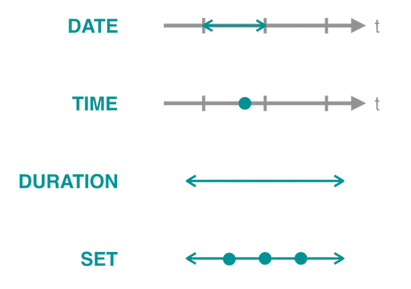

# TIMEX3タグ

TIMEX3タグは、TimeMLで提唱されたタグ仕様です。日本語におけるTIMEX3タグの仕様は小西ら\[1\]や成澤\[2\]により定義されており、`ja-timex`においてもそれらの枠組みを元に実装しています。

## ja-timexにおけるTIMEX3タグ
TIMEX3タグは、下記の属性を持ちます。

| 属性名 | 内容                                              | 例           | 条件             |
| ------ | ------------------------------------------------- | ------------ | ---------------- |
| @tid   | 入力文中に一意に付与される識別子                  | `t1`         | 必須             |
| @type  | 表現の分類。DATE, TIME, DURATION, SETの値を取る。 | `DATE`       | 必須             |
| @value | 時間情報表現が含意する値                          | `2021-07-18` | 必須             |
| @freq  | 頻度集合表現における頻度が起こる回数              | `2X`         | 頻度集合表現のみ |
| @quant | 頻度集合表現における頻度の性質                    | `EACH`       | 頻度集合表現のみ |
| @mod   | 時間情報表現の補足情報としてのモダリティ          | `APPROX`     | 任意             |
| @rangeStart   | 範囲表現の起点を表すタグ          | `True`     | 任意             |
| @rangeEnd   | 範囲表現の終点を表すタグ          | `True`    | 任意             |

### `@tid`
`@tid`は、入力テキストの中で各TIMEX3タグに対して一意に付与される識別子です。`t0`から始まり、1ずつ値が増えていきます。

### `@type`
`@type`は、以下の4つの値のうちのどれかを持ちます。

| type       | 名称         | 説明                                                                 |
| ---------- | ------------ | -------------------------------------------------------------------- |
| `DATE`     | 日付表現     | 時間軸上での時点や時区間のうち、日単位以上の粒度で表現される位置     |
| `TIME`     | 時刻表現     | 時間軸上での時点や時区間のうち、日単位より小さな粒度で表現される位置 |
| `DURATION` | 持続時間表現 | 任意の時区間幅を表現する量                                           |
| `SET`      | 頻度集合表現 | 時間軸上のある時区間の中で繰り返される事象を表す、量および位置や回数 |

{: style="width:400px"}

_各表現の概念図_

### `@value`
`@value`は対象となる時間表現の値です。抽出した時間表現に対しては、あくまでその表現単体から予測可能な値を入力するものとし、文脈を用いて補完しません。

日付や時刻表現に対しては、下記のような値の型を取ります。

| 単位   | 記号                 | 表現例                      | @value              |
| ------ | -------------------- | --------------------------- | ------------------- |
| 年月日 | XXXX-XX-XX           | 1980年7月7日                | 1980-07-07          |
| 曜日   | XXXX-WXX-X           | 水曜日                      | XXXX-WXX-3          |
| 季節   | XXXX-{SP,SU, FA, WI} | 冬                          | XXXX-WI             |
| 四半期 | XXXX-QX              | 第1四半期                   | XXXX-Q1             |
| 年度   | FYXXXX               | 1998年度                    | FYXXXX              |
| 世紀   | XXXX                 | 11世紀                      | 10XX                |
| 紀元前 | BCXXXX               | 紀元前202年                 | BC0202              |
| 時刻   | XXXX-XX-XXTXX:XX:XX  | 2006年8月8日午前8時45分30秒 | 2006-08-08T08:45:30 |
| 時刻   | TXX:XX:XX            | 午前8時45分30秒             | T08:45:30           |

また、持続時間表現に対しては下記のような値の型を取ります。

| 単位 | 記号 | 表現例 | @value  |
| ---- | ---- | ------ | ------- |
| 年   | PnY  | 3年間  | P3Y     |
| 月   | PnM  | 2ヶ月  | P2M     |
| 日   | PnD  | 5日    | P5D     |
| 週   | PnW  | 1週間  | P1W     |
| 時間 | PTnH | 3時間  | PT3H    |
| 分   | PTnM | 30分   | PT30M   |
| 秒   | PTnS | 9秒80  | PT9.80S |

これらを組み合わせることで、任意の持続時間を表現することができます。日付表現の接頭辞`P`と時刻表現の接頭辞`PT`は重複せず、`P1Y2M`や`PT1H30M`といったように降順で表現します。

### `@freq`
`@freq`は頻度集合表現において頻度が起こる回数を表す属性で、`@value`属性と同様の型の値が入ります。なお、回数表現としての`nX`は`n`回であることを表し、`X`は回数を表す記号です。値が不明なときに用いられる不定表現ではありません。

### `@quant`

`@quant`は頻度集合表現において頻度の性質を表す属性で、判定が不可能な場合には`None`が、可能な場合には下記の2つのうちのどちらかの値を取ります。

| @quant | 定義                               | 例                 |
| ------ | ---------------------------------- | ------------------ |
| EACH   | 間隔を空けずに実行される表現       | 毎日, 毎月         |
| EVERY  | 間隔を空けて定期的に実行される表現 | 3日おき, 6ヶ月ごと |

### `@mod`
`@mod`は時間情報表現のモダリティを表す属性で、日付表現および時刻表現において、判定が不可能な場合には`None`が、可能な場合には下記の中のどれか1つの値を取ります。

| @mod         | 定義                | 例           |
| ------------ | ------------------- | ------------ |
| START        | 日付/時刻表現の初期 | 始め、初期   |
| MID          | 日付/時刻表現の中期 | 半ば、中ごろ |
| END          | 日付/時刻表現の後期 | 末、暮れ     |
| BEFORE       | 日付/時刻表現より前 | 前           |
| AFTER        | 日付/時刻表現より後 | 過ぎ         |
| ON_OR_BEFORE | 日付/時刻表現以前   | 以前         |
| ON_OR_AFTER  | 日付/時刻表現以後   | 以降、以来   |
| APPROX       | 近似表現            | ごろ         |

また、持続時間表現における`@mod`は、下記の中のどれか1つの値を取ります。

| @mod   | 定義                         | 例  |
| ------ | ---------------------------- | --- |
| BEFORE | ある時点を基準としたときの前 | 1年前  |
| AFTER  | ある時点を基準としたときの後 | 1年後  |
| NOW    | ある時点を基準としたときの前後  | 今年 |

### `@rangeStart`と`@rangeEnd`
`@rangeStart`, `@rangeEnd`は範囲表現の起点を表すタグであり、通常は`None`の値を取り、範囲表現と認められる`TIMEX`の対においてのみbool型の`True`の値を取ります。`@rangeStart`と`@rangeEnd`は必ず対になり、どちらかだけが存在する場合はありません。

ja-timexの`TIMEX`タグでは[PEP8](https://www.python.org/dev/peps/pep-0008/)の命名規則に則り、`TIMEX.range_start`および`TIMEX.range_end`というインスタンス変数名に対応します。

## 小西らおよび成澤の定義との差異

### 属性の削除
ja-timexでは人間によるアノテーションの情報を表現する必要がなく、またルールベース単体での十分な文脈情報を利用した補完が不可能なため、`TIMEX`クラスではアノテーションに関する以下の属性を削除しています。

- `@valueFromSurface`: 文脈情報を考慮した正規化をしない`@value`
- `@temporalFunction`: 文脈情報より曖昧性解消可能かどうかを表す真偽値

そのかわり、`TIMEX`クラスを継承した`AnnotatedTIMEX`クラスにて、上記の4つの属性を付与できるようにしています。

### 「今月6日」といった表現を分割する
`今月6日`は`今月`,`6日`に分割してタグ付けを行います。成澤\[2\]では1つのまとまりとして扱うように定義されていましたが、ja-timexでは分割します。

その理由として、TIMEX3タグの定義上は日付表現として「いずれかの月」か「そもそも月の情報が不明」かを区別することができません。`XXXX-XX-06`という表記しかできず、今回の場合は`今月6日`のうちの`今月`の情報が表層表現から欠落してしまうため、情報の欠損を防ぐために分割しています。

`今月`は、表層表現からではどの月かを推定することが不可能なため、日付表現とは扱わず持続時間表現として扱います。

### 「XあたりY」を頻度集合表現としない
小西ら\[1\]では「1ヶ月あたり1時間」という事例を頻度表現として取得するとしていましたが、ja-timexでは取得しません。

ja-timexでは頻度集合を _時間軸上のある時区間の中で繰り返される事象を表す_ と定義しました。「1ヶ月あたり1時間」といった「において」を用いる表現では、時区間内での繰り返しを表すのではなく、任意の単位における平均した時間や回数を表現する意味合いが強いと判断しました。例えば、以下のような用例が存在します。

> 同じ調査で、インターネット閲覧者ひとりあたりの閲覧時間も発表されており、世界平均が31.3時間（1日あたり1時間1分）だった。
> 
> [世界のインターネット人口、6億9,426万人に \- ウィキニュース](https://ja.wikinews.org/wiki/%E4%B8%96%E7%95%8C%E3%81%AE%E3%82%A4%E3%83%B3%E3%82%BF%E3%83%BC%E3%83%8D%E3%83%83%E3%83%88%E4%BA%BA%E5%8F%A3%E3%80%816%E5%84%849,426%E4%B8%87%E4%BA%BA%E3%81%AB)

これは1日の中で閲覧する行為を1時間1分行うことを繰り返すというわけではなく、平均して1日に1時間1分費やすという意味です。
> 日刊スポーツによると撮影は2007年12月10日から3日間、同局より委託された制作会社が行っていた。赤ちゃんのひまわりをいつも一緒にいる母親のリリカから引き離し、1日あたり3-4時間ほど撮影したが数日後に親子は原因不明で相次いで急死し、撮影によるストレスが原因ではないかとの見方もでた。
> 
> [ドラマ撮影中のキリン親子急死で放送中止—NHK \- ウィキニュース](https://ja.wikinews.org/wiki/%E3%83%89%E3%83%A9%E3%83%9E%E6%92%AE%E5%BD%B1%E4%B8%AD%E3%81%AE%E3%82%AD%E3%83%AA%E3%83%B3%E8%A6%AA%E5%AD%90%E6%80%A5%E6%AD%BB%E3%81%A7%E6%94%BE%E9%80%81%E4%B8%AD%E6%AD%A2%E2%80%94NHK)

この場合は、文脈上からは3日間の間で繰り返し撮影が行われていることがわかりますが、「3-4時間ほど」という表現はある一定の時区間幅を表現する持続時間表現の意味合いが強く、定期的に3-4時間費やされる行為が繰り返されるわけではないと言えます。

こうした理由により、ja-timexでは「あたり」を用いた表現を頻度集合表現とは扱いません。